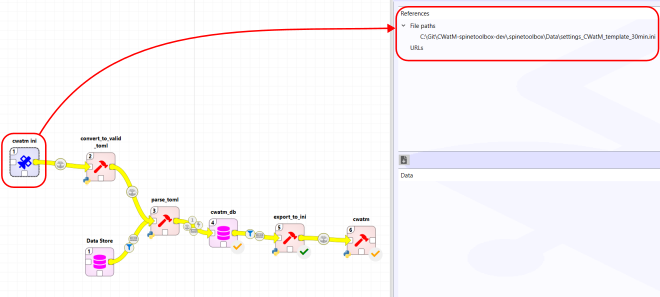
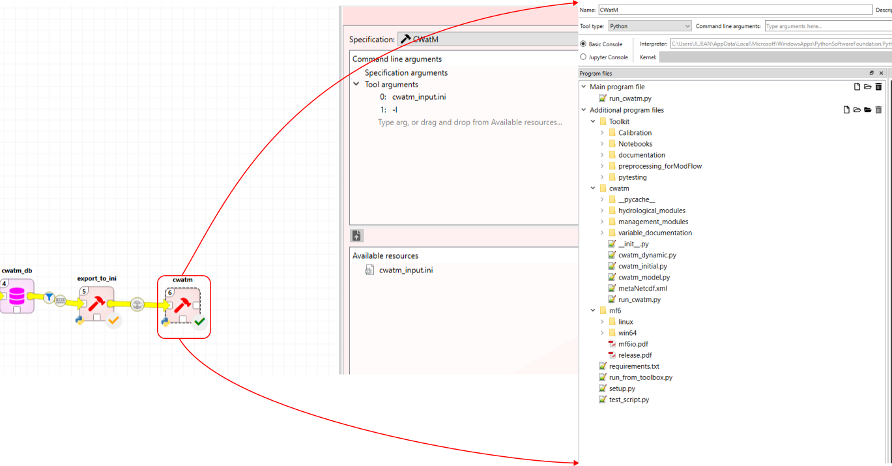

# CWatM-spinetoolbox
This [SpineToolbox](https://github.com/spine-tools/Spine-Toolbox/	"Github Link") project aimed at implementing the [CWatM Model](https://github.com/iiasa/CWatM	"Github Link") and creating the data workflow as well as scenario management . 

# Reading the workflow

To run this workflow, you will first need to setup SpineToolbox on your machine. Please refer to the [SpineToolbox](https://github.com/spine-tools/Spine-Toolbox/tree/0.8-dev	"Github Link") project to install and run it. This workflow was made using the 0.8-dev branch as it includes new features as well as the new SpineDBapi. You may have to clone locally as well the [Spine Database API](https://github.com/spine-tools/Spine-Database-API	"Github link") to use the 0.8-dev version of the spinedbapi.

All initial template files are available in the repo.

# Running the workflow

This workflow does not come with CWatM. Therefore, to use this workflow, you will need to get the CWatM model on your local machine as well. The model is well documented and tutorials are available on YouTube to learn how to install it with its dependency.

Prior to get the workflow working:

1. Make sure you have installed SpineToolbox as instructed and you are using the latest version of SpineToolbox.
2. you are using Spine Database API 
3. You have cloned CWatM locally in your machine in a separate folder
4. You have git and miniconda installed

## Setting up the workflow

1. using miniconda, create an environment where workflow and CWatM libraries and other dependencies can be installed.

2. Go to the directory where the workflow will be located e.g. `C:\Git\<YOUR FOLDER>\`

3. _cd_ into your folder `cd C:\Git\<YOUR FOLDER>\`

4. clone the git repo into the folder `git clone git@github.com:jeanlouisnico/CWatM-spinetoolbox.git`

5. create your conda environment and activate it

   `conda create -n cwatm_wf python=3.11`

   `conda activate cwatm_wf`

6. cd in the folder where the cloned git repo is installed  `cd C:\Git\<YOUR FOLDER>\CWatM-spinetoolbox`

7. Install the required libraries for the workflow to work out

   `pip install -r .spinetoolbox\requirements.txt`


You are now ready to run the workflow from SpineToolbox

## Opening the workflow and setting it up

1. run SpineToolbox from your conda environment where spinetoolbox has been setup originally `(spinetoolbox) C:\ spinetoolbox`
2. Open the workflow from File>Open project (Locate where you have cloned the project)
3. Some of the input in the database need to be adjusted based on your file location (meteorological, and other relevant files like maps etc...)


Not that if you already have an existing workflow from a previous project, you can change the origin of the ini file from the file you have been previously configuring as shown in the picture below. This workflow is split into different section that can run as a whole or can be run by section (by selection the boxes, one can run only the selected workflows)


1. Import of the calibration .ini file into the database

   

2. Resetting the database by deleting all its components except the Base alternative. The entities inside the Base alternative are removed

   

3. Import of base CWatM (for setting up the database) and of any CWatM file that end user want to import into the database

   

4. This is the central database, also called the Spine Database, where all the data are stored. Alternative and Scenario can be created and if any data needs to be changed, added, add new main section in the .ini files can be done

5. Export the database for the calibration and run the calibration. It exports 2 .ini files: one for the calibration setup and one for the CWatM model that needs to be calibrated. The output from the calibration are then exported and setup from the best alternative is then imported back into the database under the alternative "best_calib".

   

6. Run a regular CWatM flow. This is done from the database and can be run in sequence from the calibration set up.

   



## Include CWatM

As CwatM repo is quite large, it is not included in the workflow. Once you have cloned CWatM on your computer, either copy the entire CWatM folder under your workflow repo e.g. `C:\Git\<YOUR FOLDER>\` or you would need to re-link all the files defined in the cwatm tool in the workflow to the folder where CWatM is located



# Why using the workflow

One of the main point of using this workflow to run CWatM model, is that you can create all alternatives and scenarios that one needs to run, and parallelise your run automatically. This is done through the UI of the cwatm_db where you can change all input/output data from the model.
All scenarii will be stored in its own folder containing all \*.nc files generated by CWatM and can be accessed through the Spine Toolbox interface. In this regard, the value to provide to _FILE_PATHS\Pathout_ is a folder name e.g. _outputcwatm_. This folder will be created upon exporting the database.

NB: if you have already changed the database _cwatm_db_, while running the entire workflow, make sure that second argument in the ***parse_toml*** tool is set to **<u>false</u>**. This will prevent to overwrite the existing database and loose all your changes. Usually the **<u>true</u>** statement is used only for 1. setting up the database. 2. reset the database to its original settings.  

## Create multiple databases

If one need, you may just create a new spine database if you want to switch from databases and avoid to have everything in a single database.

``` sh
pip install mkdocs-material=="9.*" # (1)!
```
