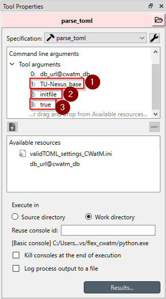
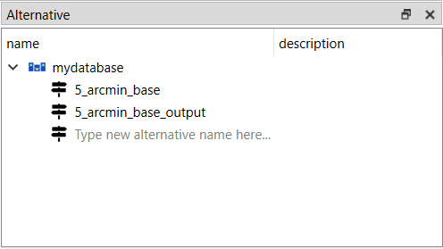
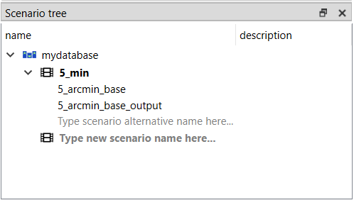

# Running standalone version

Let's setup an instance of SpineToolbox (hereafter **Toolbox**) by creating an empty database, importing the initial init file provided by the example of CWatM. We will then import the calibration file. We will then see how to create alternatives to the base init file or import a new initial file from CWatM. Finally, we will to calibration run, running CWatM as a standalone model and running CWatM model as model coupling with an energy system model.

## New Database

### Setting the database

Before starting setting up a totally new workflow, **Toolbox** requires to be linked to a database. In this particular case we are using .*sqlite*, but one can choose between *sqlite* and *mysql*. Create a new database by first selecting the data store . This will display the *Data Store Properties* (DSP). From the DSP, click the *New Spine db* button to save your database in your environment.

!!! Tip

    Good practices would be that the new database is saved under \.spinetoolbox\Data\

You will then need to:

- Edit the path of the database in the following data store (copy/paste the relative path or select the file from the file icon )
  - *Data Store*
  - *data_store_loop*
  - *best_calib*

This step will create an empty database with one alternative called *Base*. This alternative will be empty and we can now start populating the data from 1. a data structure that can be imported into the database or 2. a n existing CWatM **.ini* file into the database. 

### Populating the database
#### Method 1: Import an existing database

This method is the easiest if you are starting with a new CWatM project. [Download](../.spinetoolbox/Data/basic_model.json) (right-click and save the file) the .json document that will parse the database with the CWatM 30 min examples with already pre-defined alternatives and scenario (for a single run of CWatM and calibration). This database has more parameters already defined from other CWatM projects (i.e. 5-arcmin). 

This method is the most convenient and should be done anyway as parameters are declared properly. one could then import an existing ini file into this database later on.

#### Method 2: Import from CWatM ini file
!!! Tip

    This section refers to the [import ini file section](navigating.md/#3-import-cwatm-ini-files) part of the workflow

The best way to start importing existing ini file within **Toolbox** is to take one of the CWatM setting files for the 30 arcmin or 5 arcmin. In this example we will populate the 5 arcmin setting files but this setup can be done with the 30 arcmin as well.

First, select the data connection box that will link the ini file to **Toolbox**. This will display the Data Connection Properties (DCP) window on the right-hand side. In case a filepath is already present in the File paths field, adding a new file will be made in addition to the current file path. One can safely remove the link by right cliking the filepath and click *remove reference(s)* or click the - button while having the filepath selected. By clicking the + icon you can select the ini setting file.

As mentioned earlier, if a tool is marked with an exclamation mark :exclamation:, this means that there is a problem in the workflow. By changing the reference setting file, this will most likely be triggered in the following step but can easily be corrected.

The next step is to ensure that the file is considered in the workflow. Select the *convert_to_valid_toml* tool and it will display its Tool Properties window on the right hand side. If the name of the file from the Tool arguments exist in the Available resources listed in the tool, then this is all good and the tool is configured correctly. In case the tool arguments is displayed in red, this means that the file is not available in the Available resources. It usually happens if the file in the data connection is changed (see previous step). Simply drag and drop the file from the Available resources to the Tool arguments, then remove the link displayed in red by selecting the argument and click the - button .

The second tool *parse_toml* is very important and the end-user wants to put attention into the arguments that are passed to the tool. Since there can be multiple *ini* files that are imported into the *Spine Database*, each variable should be loaded into a different **alternative**. If the **alternative** name is not changed, it will overwrite the previously imported *ini* file.

The second argument :one:: is the name of the *alternative* where the ini file *parameters* will be imported in, in this tutorial we will name it *5_arcmin_base*. The :two: argument should not be touched and left as is. This is to tell the importer that we are importing a cwatm ini file. The :three: argument define that it will update the values and should be always set to *true* if you want to update the existing alternative, if not set it to *false*. Select the 3 tool together and run only the selection . Running only this section will import your CWatM *ini* file into the Spine Database.

This will import 2 alternatives, the first one being the CWatM core ini file, and another one named <YOUR ALTERNATIVE>_output, which allocate the outputs in a separate alternative. This is to better use the structure of the data with the calibration runs.

!!! Tip

    In case you have multiple *ini* file that you want to import, repeat these steps as many times as necessary. You can try this out by duplicating the original setting file and change some values in it. Relink the file in the workflow as explained in this section but allocate it to a different alternative. It will create a new alternative and import only the variables that differ from the base database that we first imported into the database.

### Fix the database for Toolbox

!!! Tip

    This section refers to the [database section](navigating.md/#4-the-spine-database) part of the workflow

The **Toolbox** database will be displaying exactly what was in the ini file originally. Therefore, the path to weather files and others should be correct. However, if the setting file was imported as is, the path filepaths need to be updated.

The most important one is the ***PathRoot*** parameter_name in the FILE_PATHS entity. Locate where the input files were saved on the machine. Other filepaths that needs attention are: **FILE_PATHS\PathMeteo**, and if necessary the **FILE_PATHS\Excel_settings_file parameter_names**.

The last parameter that requires to be changed is due to the use of Toolbox, this is the output folder location FILE_PATHS\PathOut. 

!!! Tip

    If you have first imported the CWatM database from the json file, the output database alternative already exists. Either change the alternative name for the output variables or simply delete the parameters.

One of the feature of running CWatM with Toolbox is that you can run all your scenarios in parallel. These parallelisation of the runs is automatically handled by Toolbox. However, since CWatM is writing outputs after every loop, the output folder will need to be defined relative to the path of the scenario. Simply replace the string in the **FILE_PATHS\PathOut** to `./output`. Toolbox will then create an output folder for every scenario and will avoid reading and writing to the same output files.

#### Other changes

Cold and Warm starts are possible in CWatM. The settings are located under the entity class INITITIAL CONDITIONS. The parameter **initLoad** and **initSave** should be modified similarly to the output folder and making it relative path to the project e.g. *./init/<FILENAME>* and similarly initLoad should resemble the same pattern *./init/<FILENAME>.nc*

!!! Tip

    After every modification of the database, it needs to be commited by ctrl+enter or click the icon commit 

## Relink CWatM

The CWatM tool is linked by default to be under the current repository. Often, people will have their own CWatM copy and therefore there a need to relink the CWatM module. This is because when cloning/forking this workflow, **Toolbox** assumes that the tool comes along with it but we do not want to ship CWatM alongside this workflow but rather link to a self-contained CWatM model (whether you are developing it or just using it). In order to do perform the relink, you need to open any CWatM tool e.g.

 

By double clicking the icon, you will see the files that are included in the tool.

The main programme :one: needs to be updated first and then all the other programmes. While the main programme is selected, open the white folder :two:and locate the CWatM folder locally, and select the *toolbox_compatibility.py* file. For the files in :four:, open the white folder and multi-select each of the three python scripts, then select the black folder in :three: to relink all the files from the *cwatm* and the *mf6* folders. Save your work and you can close the window.

!!! Tip

    There are two ways to relink files, either relink a single file by using the white folder icon , or relink all the files in a folder by using the black folder icon 

## Prepare a scenario

When we imported the data from the original ini file from CWatM to the database, we have created an alternative called *5_arcmin_base*. Toolbox can run either a specific alternative or scenario, which is a combination of multiple alternatives. Running scenario is the preferred way to run the data flow to keep consistency between all model runs. From the database, there is a list of scenario that user can create on the right-hand side.

Select an empty scenario and input a name for a scenario e.g. *5_arc_min*. 

!!! Tip

    For differentiating alternative and scenario names, it is good practice to change the name that it is clearer when you are using the workflow what you are using, an alternative or a scenario setup.

You can now drag and drop alternatives to a specific scenario. There are no limitations to how many alternatives are allocated to a scenario, however, one must be careful in which order they are listed in the scenario. **Toolbox** handles the data allocations based on the order the alternatives were set in the scenario. In essence, Toolbox will take all the values from the first alternative, then take the values from the nth alternative to either replace the values or supplement the data with new data if it was not present in the previous alternative.

This is the reason it is recommended to have a *Base* alternative that the modeller can always refer to and alter with other alternatives when necessary.

By default, the 5_arc_min scenario will be selected into the workflow. If you happen to create more scenarios (by combining multiple alternatives) and want to run only specific scenario, you can select the scenario run by selecting the yellow arrow in the workflow.

## Running CWatM as a standalone version

With these settings, the database can be modified (adding alternatives and scenario) and can run CWatM as a standalone application. 

Select the two tools in [standalone workflow](navigating.md/#6-run-cwatm-as-a-standalone-process), and run the select button . This will run the scenario 

