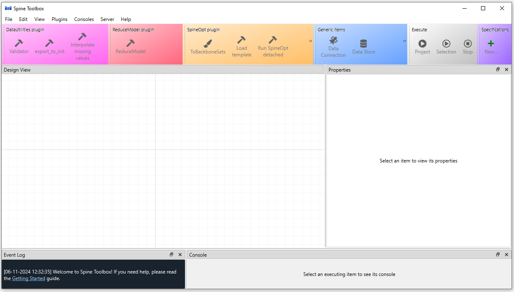
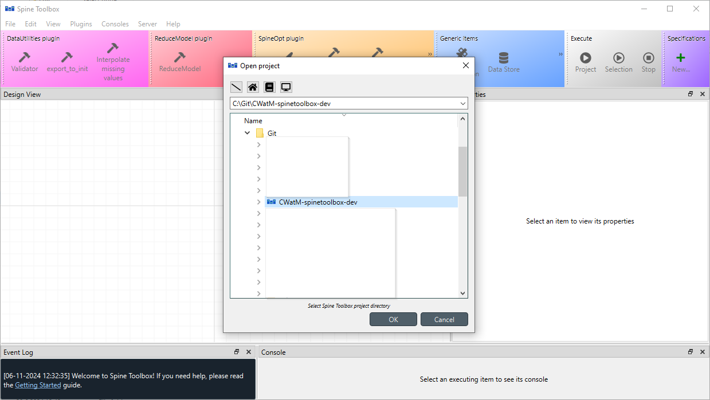
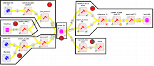

# Getting Started
## Before running the workflow

This workflow does not come with CWatM. Therefore, to use this workflow, you will need to get the CWatM model on your local machine as well. The model is well documented and tutorials are available on [YouTube](https://www.youtube.com/@MikhailSmilovic) to learn how to install it with its dependency.

### Python

The best way to interact with the different packages is to work in a virtual environment in e.g. miniconda. 

### SpineToolbox

Make sure you have installed [SpineToolbox](https://github.com/spine-tools/Spine-Toolbox/) as instructed and you are using the latest version of SpineToolbox. The recommended way is to install it using the binary file. In this examples, we are using the Git repository but it does not change the workflow setup.

1. Make sure you have installed SpineToolbox as instructed and you are using the latest version of SpineToolbox.
2. you are using Spine Database API 

### FlexTool

TBD

### CWatM-SpineToolbox

1. using miniconda, create an environment where workflow and CWatM libraries and other dependencies can be installed.

2. Go to the directory where the workflow will be located e.g. `C:\Git\<YOUR FOLDER>\`

3. _cd_ into your folder `cd C:\Git\<YOUR FOLDER>\`

4. clone the git repo into the folder `git clone git@github.com:jeanlouisnico/CWatM-spinetoolbox.git`

5. create your conda environment and activate it

   `(base) C:\Git\<YOUR FOLDER>\> conda create -n <YOUR ENV> python=3.11`

   `(base) C:\Git\<YOUR FOLDER>\> conda activate <YOUR ENV>`

6. cd in the folder where the cloned git repo is installed  `cd C:\Git\<YOUR FOLDER>\CWatM-spinetoolbox`

7. Install the required libraries for the workflow to work out

```bash
(<YOUR ENV>) C:\Git\<YOUR FOLDER>\CWatM-spinetoolbox> pip install -r .spinetoolbox\requirements.txt
```

### CWatM

The best way to interact with CWatM is to clone or fork the git version of the [repository](https://github.com/iiasa/CWatM).

As described in the CWatM instructions to run the model, it is best to download all necessary versions for [30](https://github.com/iiasa/CWatM-Earth-30min), [5 arcmin](https://drive.google.com/drive/folders/1HqcBj5fD6DHJpOe-t_6JHFMKFtubghZf?usp=drive_link) and [weather data](https://drive.google.com/drive/folders/1_xlg_RZvx9xsVPddOiqCG3XZmASCBIRM?usp=drive_link) or directly from the [ISIMIP](https://www.isimip.org/gettingstarted/input-data-bias-adjustment/details/110/) repository.  This is then to be changed in the path to locate where those folders will be downloaded. 

!!! Warning

    The weather files provided from CWatM are from 1980 to 2019 (as of February 2025). If your calibration runs start before this data, you should download the data from the ISIMIP repository (starts from 1901).

Alongside the CWatM-SpineToolbox deliverable, the *toolbox_compatibility.py* file needs to be copied to the CWatM folder. this python script allows to start different instances of CWatM from python script instead of command line as traditionally used by the CWatM community. The file is currently located under *.\CWatM-spinetoolbox\calibration\CWatM*. This python file needs to be placed under *.\CWatM* folder in the local computer.

## How to use

Once all the tools are installed you can first launch SpineToolbox from terminal or miniconda (depending on how SpineToolbox has been installed) and then open the SpineToolbox project that integrates CWatM and FlexTool. It should launch the SpineToolbox interface as below.



in File>Open project (ctrl+o), locate the folder where the CWatM-spinetoolbox repository on your computer (following the structure above, it should be located here `C:\Git\<YOUR FOLDER>\`). This will open the basic workflow of the model coupling. With this workflow you can



1. Make calibration runs;
2. Make CWatM runs as a standalone application
3. Make model coupling runs between CWatM and IRENA FlexTool 

### What is the workflow about?

Not that if you already have an existing workflow from a previous project, you can change the origin of the ini file from the file you have been previously configuring as shown in the picture below. This workflow is split into different section that can run as a whole or can be run by section (by selection the boxes, one can run only the selected workflows) 

:one: Import of the calibration .ini file into the database

:two: Resetting the database

:three: Import CWatM .ini files

:four: The Spine Database

:five: Run your calibration

:six: Run CWatM as a standalone application

:seven: Run CWatM with IRENA FlexTool 

!!! Tip

    You can also select each of the yellow arrows to see more options on how the workflow works. 

!!! Tip

    Please go through the SpineToolbox documentation for an extended explanation of what are each boxes role and if needed how to modify the workflow


Material for MkDocs is published as a [Python package](https://pypi.org/project/mkdocs-material/) and can be installed with `pip`, ideally by using a [virtual environment](https://realpython.com/what-is-pip/#using-pip-in-a-python-virtual-environment). Open up a terminal and install Material for MkDocs with:

=== "Latest"

    ``` sh
    pip install mkdocs-material
    ```

=== "9.x"

    ``` sh
    pip install mkdocs-material=="9.*" # (1)!
    ```
    
    1.  Material for MkDocs uses [semantic versioning][^2], which is why it's a
        good idea to limit upgrades to the current major version.
    
        This will make sure that you don't accidentally [upgrade to the next
        major version], which may include breaking changes that silently corrupt
        your site. Additionally, you can use `pip freeze` to create a lockfile,
        so builds are reproducible at all times:
    
        ```
        pip freeze > requirements.txt
        ```
    
        Now, the lockfile can be used for installation:
    
        ```
        pip install -r requirements.txt
        ```

[^2]:
    Note that improvements of existing features are sometimes released as
    patch releases, like for example improved rendering of content tabs, as
    they're not considered to be new features.


!!! tip

    If you don't have prior experience with Python, we recommend reading
    [Using Python's pip to Manage Your Projects' Dependencies], which is a
    really good introduction on the mechanics of Python package management and
    helps you troubleshoot if you run into errors.

