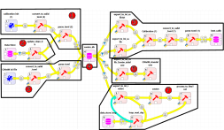

# Getting Started
## Before running the workflow

This workflow does not come with CWatM. Therefore, to use this workflow, you will need to get the CWatM model on your local machine as well. The model is well documented and tutorials are available on YouTube to learn how to install it with its dependency.

Prior to get the workflow working:

1. Make sure you have installed SpineToolbox as instructed and you are using the latest version of SpineToolbox.
2. you are using Spine Database API 
3. You have cloned CWatM locally in your machine in a separate folder
4. You have git and miniconda installed

## Setting up the workflow

1. using miniconda, create an environment where workflow and CWatM libraries and other dependencies can be installed.

2. Go to the directory where the workflow will be located e.g. `C:\Git\<YOUR FOLDER>\`

3. _cd_ into your folder `cd C:\Git\<YOUR FOLDER>\`

4. clone the git repo into the folder `git clone git@github.com:jeanlouisnico/CWatM-spinetoolbox.git`

5. create your conda environment and activate it

   `conda create -n cwatm_wf python=3.11`

   `conda activate cwatm_wf`

6. cd in the folder where the cloned git repo is installed  `cd C:\Git\<YOUR FOLDER>\CWatM-spinetoolbox`

7. Install the required libraries for the workflow to work out

   `pip install -r .spinetoolbox\requirements.txt`
   
   ```
   pip insall
   ```
   
   ```shell
   
   foo@bar:~$ whoami
   foo
   C:\> pip install dependencies
   ```

## How to use

Not that if you already have an existing workflow from a previous project, you can change the origin of the ini file from the file you have been previously configuring as shown in the picture below. This workflow is split into different section that can run as a whole or can be run by section (by selection the boxes, one can run only the selected workflows)



1. Import of the calibration .ini file into the database

   

2. Resetting the database by deleting all its components except the Base alternative. The entities inside the Base alternative are removed

   

3. Import of base CWatM (for setting up the database) and of any CWatM file that end user want to import into the database

   

4. This is the central database, also called the Spine Database, where all the data are stored. Alternative and Scenario can be created and if any data needs to be changed, added, add new main section in the .ini files can be done

5. Export the database for the calibration and run the calibration. It exports 2 .ini files: one for the calibration setup and one for the CWatM model that needs to be calibrated. The output from the calibration are then exported and setup from the best alternative is then imported back into the database under the alternative "best_calib".

   

6. Run a regular CWatM flow. This is done from the database and can be run in sequence from the calibration set up.

   


## Example model

A simple example model simple, imaginary energy system is documented here. The input data file of the example model can be found under */input_data/example_model.xlsx*. The system contains natural gas, electricity and heat, and electricity and electricity reserve products are sold on an external market *m*. The example model contains two possible scenarios for input data, *s1* and *s2*, with equal probabilities of occurring (0.5). The data used for prices, heat demand, capacity factors, etc. is randomly generated. 

#### Nodes

The modelled system consists of three main nodes: ***ng***, symbolizing a node containing natural gas, ***elc*** symbolizing a node containing electricity, and ***heat***, a node containing heat, such as a district heating system. The *ng* node is a *commodity node*, from which natural gas can be bought at a price defined in the *price* sheet. The *heat* node has a negative *inflow* added to it, which can be seen as a heat demand in the system. The *elc* node is connected to a market node ***m***, *npe*, from which electricity can be bought or sold. 

#### Processes 

Processes are used to convert or transfer energy between nodes in the modelled system. The process ***windturb*** symbolizes a wind turbine producing electricity to the *elc* node. The production of *windturb* is limited by a capacity factor time series, defined in the *cf* sheet. The process ***ngchp*** converts natural gas from the *ng* node into electricity to the *elc* node and heat to the *heat* node at a fixed ratio, which is defined in the *constraint* and *gen_constraint* sheets. The ***heatpump*** unit convert electricity from the *elc* node into heat in the *heat* node. When the market *m* is defined, a process for trading between *elc* and *m* is automatically generated. 

The constraint to define the operation of the *ngchp* process is setup in the *constraints* and *gen_constraint* sheets. The flat efficiency of the *ngchp* process is set to 0.9, including both heat and power. The maximum capacity of the natural gas input is set to 10, the heat is 6, and the electricity is 3. *ngchp* should produce electricity and heat at a 1:2 ratio. To achieve this, constraint called *ngchp_c1* is defined in the sheet *constraints*.

The reserve products ***res_up*** and ***res_down*** are sold in the *elc* node. The processes *ngchp* and *heatpump* are used to offer reserve capacity. 


Basic structure of the example model.

| name     | operator | is_setpoint | penalty |
|----------|----------|-------------|---------|
| ngchp_c1 | eq       | 0           | 0       |

Further, the factors for the constraint are defined in the *gen_constraint* sheet. The operator of the created constraint is *eq*, meaning equal.  The sum of the factors (the process branches *elc* and *heat* multiplied by given constants) and a given constant should equal 0. With a 1:2 ratio of electricity and heat production, the constants given to the process flows should be -2 and 1, or 2 and -1, for electricity and heat respectively. This can be seen in the table below, where the factors and constraints are defined for *s1*. The factors have to be defined again for *s2*.

| t  | ngchp_c1,ngchp,elc,s1 | ngchp_c1,ngchp,heat,s1 | ngchp_c1,s1|
|----|-----------------------|------------------------|------------|
| t1 | -2                    | 1                      | 0          |
| t2 | -2                    | 1                      | 0          |
| tn | -2                    | 1                      | 0          |

