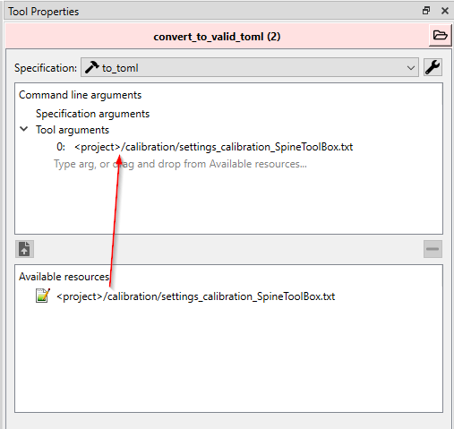
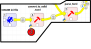
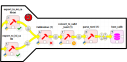

# Getting Started
## Before running the workflow

This workflow does not come with CWatM. Therefore, to use this workflow, you will need to get the CWatM model on your local machine as well. The model is well documented and tutorials are available on YouTube to learn how to install it with its dependency.

Prior to get the workflow working:

1. Make sure you have installed SpineToolbox as instructed and you are using the latest version of SpineToolbox.
2. you are using Spine Database API 
3. You have cloned CWatM locally in your machine in a separate folder
4. You have git and miniconda installed

## Setting up the workflow

1. using miniconda, create an environment where workflow and CWatM libraries and other dependencies can be installed.

2. Go to the directory where the workflow will be located e.g. `C:\Git\<YOUR FOLDER>\`

3. _cd_ into your folder `cd C:\Git\<YOUR FOLDER>\`

4. clone the git repo into the folder `git clone git@github.com:jeanlouisnico/CWatM-spinetoolbox.git`

5. create your conda environment and activate it

   `conda create -n cwatm_wf python=3.11`

   `conda activate cwatm_wf`

6. cd in the folder where the cloned git repo is installed  `cd C:\Git\<YOUR FOLDER>\CWatM-spinetoolbox`

7. Install the required libraries for the workflow to work out

   ```bash
   (cwatm_wf) C:\Git\<YOUR FOLDER>\ pip install -r .spinetoolbox\requirements.txt
   ```

## How to use

Not that if you already have an existing workflow from a previous project, you can change the origin of the ini file from the file you have been previously configuring as shown in the picture below. This workflow is split into different section that can run as a whole or can be run by section (by selection the boxes, one can run only the selected workflows)


### 1. Import of the calibration .ini file into the database


The calibration init file is the typical CWatM ini file that is given in the tutorials. You can re-link the file depending on where you have installed your CWatM copy. The purpose of this process is to populate the ini file entities, parameters, and parameter values into the spine DB interface. All parameters can further be modified once imported into the database. If the calibration init file is modified, a warning -:exclamation:- will be displayed on the first tool meaning that the file needs to be relinked. In this case, just drag and drop the file from the *Available resources* to the *Tool arguments*. The first tool converts the init file into a valid toml file that is standardised and can easily be imported into the *SpineDatabase*.



The parsing of the formatted toml file is then done and nothing should be changed unless the user changes the name of the SpineDB database in the workflow, in which case the input data needs to be re-linked as well as previously shown.

### 2. Resetting the database


!!! warning

    This second section is to be used cautiously. This resets the database by deleting all its components except the *Base* alternative. The entities inside the *Base* alternative are removed and only the *Base* alternative remains empty. 


By default, the second argument is set to ***false***, which does not reset the Spine Database and just bypasses the whole tool. In case one would like to reset the entire database, set the second argument to ***true*** and the entire Spine Database will be reset.

### 3. Import CWatM .ini files



The third section Imports your working CWatM *ini* file. In essence, you would not need both connectors but for the sake of clarity, two *data connectors* are placed in the workflow. The first *data connector* defines the basic format of CWatM using the *<u>setting_CWatM_template_30min.ini</u>* file distributed by CWatM. The second *data connector* is used to populate any *.ini file that is generated by the user. In both cases, ensure that the paths to the ini files are correct in the *Data Connection Properties* window. 

!!! Attention

    In the first tool, the original *ini* file is being converted into a valid *toml* file. Ensure that the file you want to use is the one you want to import in the Spine Database. 

The second tool is very important and the end-user wants to put attention into the arguments that are passed to the tool. Since there can be multiple *ini* files that are imported into the *Spine Database*, each variable should be loaded into a different **alternative**. If the **alternative** name is not changed, it will overwrite the previously imported *ini* file.


The second argument :one:: is the name of the *alternative* where the ini file *parameters* will be imported in. The :two:: argument define that it will update the values and should be always set to *true*. Running only this section will import your CWatM *ini* file into the Spine Database.

### 4. The Spine Database

This is the central database, also called the Spine Database, where all the data are stored. *Alternative* and *Scenario* can be created manually and if any data needs to be changed, added, or add new main section in the *.ini* files can be done from the database. When double clicking on database, it will open the Spine Database interface that would look like somewhat similar to what is shown below.


The *Entities* are shown on the left-hand side of the table. By selecting the *entity*, only the parameters from the selected entity will be displayed

!!! Tip

    Pay special attention to the *FILE_PATHS* entity as this is the one that will vary between the different alternative e.g. meteo files for the 30-arcmin or 5-arcmin spatial resolution


### 5. Run your calibration

Export the database for the calibration and run the calibration. It exports 2 .ini files: one for the calibration setup and one for the CWatM model that needs to be calibrated. The output from the calibration are then exported and setup from the best alternative is then imported back into the database under the alternative "best_calib".



### 6. Run CwatM

Run a regular CWatM flow. This is done from the database and can be run in sequence from the calibration set up.


<!---

Material for MkDocs is published as a [Python package](https://pypi.org/project/mkdocs-material/) and can be installed with `pip`, ideally by using a [virtual environment](https://realpython.com/what-is-pip/#using-pip-in-a-python-virtual-environment). Open up a terminal and install Material for MkDocs with:

=== "Latest"

    ``` sh
    pip install mkdocs-material
    ```

=== "9.x"

    ``` sh
    pip install mkdocs-material=="9.*" # (1)!
    ```
    
    1.  Material for MkDocs uses [semantic versioning][^2], which is why it's a
        good idea to limit upgrades to the current major version.
    
        This will make sure that you don't accidentally [upgrade to the next
        major version], which may include breaking changes that silently corrupt
        your site. Additionally, you can use `pip freeze` to create a lockfile,
        so builds are reproducible at all times:
    
        ```
        pip freeze > requirements.txt
        ```
    
        Now, the lockfile can be used for installation:
    
        ```
        pip install -r requirements.txt
        ```

[^2]:
    Note that improvements of existing features are sometimes released as
    patch releases, like for example improved rendering of content tabs, as
    they're not considered to be new features.


!!! tip

    If you don't have prior experience with Python, we recommend reading
    [Using Python's pip to Manage Your Projects' Dependencies], which is a
    really good introduction on the mechanics of Python package management and
    helps you troubleshoot if you run into errors.

