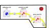
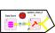

# Getting Started
## Before running the workflow

This workflow does not come with CWatM. Therefore, to use this workflow, you will need to get the CWatM model on your local machine as well. The model is well documented and tutorials are available on YouTube to learn how to install it with its dependency.

Prior to get the workflow working:

1. Make sure you have installed SpineToolbox as instructed and you are using the latest version of SpineToolbox.
2. you are using Spine Database API 
3. You have cloned CWatM locally in your machine in a separate folder
4. You have git and miniconda installed

## Setting up the workflow

1. using miniconda, create an environment where workflow and CWatM libraries and other dependencies can be installed.

2. Go to the directory where the workflow will be located e.g. `C:\Git\<YOUR FOLDER>\`

3. _cd_ into your folder `cd C:\Git\<YOUR FOLDER>\`

4. clone the git repo into the folder `git clone git@github.com:jeanlouisnico/CWatM-spinetoolbox.git`

5. create your conda environment and activate it

   `conda create -n cwatm_wf python=3.11`

   `conda activate cwatm_wf`

6. cd in the folder where the cloned git repo is installed  `cd C:\Git\<YOUR FOLDER>\CWatM-spinetoolbox`

7. Install the required libraries for the workflow to work out

   `pip install -r .spinetoolbox\requirements.txt`
   
   ```bash
   (cwatm_wf) C:\Git\<YOUR FOLDER>\ pip install dependencies
   ```

## How to use

Not that if you already have an existing workflow from a previous project, you can change the origin of the ini file from the file you have been previously configuring as shown in the picture below. This workflow is split into different section that can run as a whole or can be run by section (by selection the boxes, one can run only the selected workflows)


1. Import of the calibration .ini file into the database

   

2. Resetting the database by deleting all its components except the Base alternative. The entities inside the Base alternative are removed

   

3. Import of base CWatM (for setting up the database) and of any CWatM file that end user want to import into the database

   

4. This is the central database, also called the Spine Database, where all the data are stored. Alternative and Scenario can be created and if any data needs to be changed, added, add new main section in the .ini files can be done

5. Export the database for the calibration and run the calibration. It exports 2 .ini files: one for the calibration setup and one for the CWatM model that needs to be calibrated. The output from the calibration are then exported and setup from the best alternative is then imported back into the database under the alternative "best_calib".

   

6. Run a regular CWatM flow. This is done from the database and can be run in sequence from the calibration set up.

   


<!---

Material for MkDocs is published as a [Python package](https://pypi.org/project/mkdocs-material/) and can be installed with `pip`, ideally by using a [virtual environment](https://realpython.com/what-is-pip/#using-pip-in-a-python-virtual-environment). Open up a terminal and install Material for MkDocs with:

=== "Latest"

    ``` sh
    pip install mkdocs-material
    ```

=== "9.x"

    ``` sh
    pip install mkdocs-material=="9.*" # (1)!
    ```
    
    1.  Material for MkDocs uses [semantic versioning][^2], which is why it's a
        good idea to limit upgrades to the current major version.
    
        This will make sure that you don't accidentally [upgrade to the next
        major version], which may include breaking changes that silently corrupt
        your site. Additionally, you can use `pip freeze` to create a lockfile,
        so builds are reproducible at all times:
    
        ```
        pip freeze > requirements.txt
        ```
    
        Now, the lockfile can be used for installation:
    
        ```
        pip install -r requirements.txt
        ```

[^2]:
    Note that improvements of existing features are sometimes released as
    patch releases, like for example improved rendering of content tabs, as
    they're not considered to be new features.


!!! tip

    If you don't have prior experience with Python, we recommend reading
    [Using Python's pip to Manage Your Projects' Dependencies], which is a
    really good introduction on the mechanics of Python package management and
    helps you troubleshoot if you run into errors.

[Python package]: https://pypi.org/project/mkdocs-material/
[virtual environment]: https://realpython.com/what-is-pip/#using-pip-in-a-python-virtual-environment
[semantic versioning]: https://semver.org/
[upgrade to the next major version]: upgrade.md
[Markdown]: https://python-markdown.github.io/
[Pygments]: https://pygments.org/
[Python Markdown Extensions]: https://facelessuser.github.io/pymdown-extensions/
[Using Python's pip to Manage Your Projects' Dependencies]: https://realpython.com/what-is-pip/


This will aut

--->

