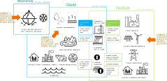

# Why integrating hydrology and energy system models

## For Whom?

IRENA FlexTool was primarily designed to be used for planning the energy transition in developing countries. It is developed by VTT for IRENA and it is distributed to IRENA members. IRENA FlexTool is also accessible on GitHub. With the growing complexity of energy system planning, the need to have an understanding of where the water comes from and goes become necessary to better manage hydropower stations that are installed along a river basin. To this extent, 

## How does it work

The first challenge is to identify what each model can perform and provide as an input to the next model. the limitations of each model should be acknowledged in case further improvement or specific challenges need to be tackled. CWatM is very versatile and has integrated many features and sectors over the years. It integrates global weather files and extract the data needed for the studied basin. It can further simulate discharge flows from one cell to another with a daily resolution. It evaluates the reservoirs level and can allocate water resources for agricultural, domestic, industrial, or farming use. Groundwater is also possible to simulate via the existing integration of CWatM and Modflow6 in the core of CWatM. 

In essence, the modelling concept consists of 3 modules; one of the glacier module, one for the hydrology modelling, and the energy system modelling. The purpose of this workflow is to combine only the last two modules, namely CWatM for the hydrology and IRENA FlexTool for the energy system model. 

CWatM can simulate changes in the water flow by including rainfall patterns, lakes, and reservoirs charge and discharge, and includes the water demand from domestic, industrial, and agricultural activities. The types of crops need to be defined in the model to have a better representation of the crop rotation and water demand cycle throughout the growth cycle of plants.  It then calculates the spilled water from hydropower stations to evaluate the amount of water that goes through the downstream water flow. This is where the coupling of the energy system model and the hydrology model becomes interesting as hydropower may have different water spillage fluctuations based on market and energy needs. 

### The energy system side

The energy system, through multiple countries, must be represented in FlexTool and a set of data comprising of the energy system, power production units, capacity, fuel types, ramp rates (up and down), infrastructure specification on transmission networks etc... must be collected and detailed (see [section on data](#data_needs)). This first stage is common practice in building any energy system models.

To consider the cascading hydropower sector, the hydropower stations that are part of the same basin are taken away from the main node and details on these specific hydropower stations need to be provided. Other hydropower capacity are aggregated under one node. In case other trading countries are included, the energy system of the trading countries need to be included in a similar manner. 

####  Data needs

The following data are needed to build the energy system model and should serve as a guideline to collect data.

| **Demand node**                                              |                                    |                                                              |
| ------------------------------------------------------------ | ---------------------------------- | ------------------------------------------------------------ |
| Location / region                                            |                                    | A map that shows how the nodes have been split               |
| Annual demand                                                | Historical and future if available | [MWh]                                                        |
| Demand time series                                           | Historical profile.                | [MWh] Will be scaled to match the annual value               |
|                                                              |                                    |                                                              |
| **Storage**                                                  |                                    |                                                              |
| Existing storage  capacity                                   |                                    | [MWh or m3 in case of hydro]                                 |
| Investment cost                                              | If relevant/available              | [currency/kWh] Investment cost for new storage capacity.     |
|                                                              |                                    |                                                              |
| **Units**                                                    |                                    |                                                              |
| Location (which  node)                                       |                                    |                                                              |
| Existing capacity                                            |                                    | [MW]                                                         |
| Efficiency                                                   |                                    | [factor] Conversion efficiency of a unit.                    |
| Minimum load                                                 | If relevant and if available       | [0-1] Minimum load of the unit.                              |
| Efficiency at minimum load                                   | If relevant and if available       | [e.g. 0.4 means 40%] Efficiency of the unit at minimum load. |
| Investment cost                                              | If relevant                        | [currency/kW of output]                                      |
| Fixed annual cost                                            | If relevant                        | [currency/kW of output/year] Annually recurring costs        |
| Startup cost                                                 | Ïf relevant                        | [currency/MW] Cost of starting up one MW of capacity.        |
| Other operational cost                                       | Other than fuel/startup costs      | [currency/MWh]                                               |
| Unit size                                                    | If relevant/available              | [MW] For units consisting of multiple sub-units.             |
| Fuel                                                         | If relevant                        | If multiple fuels possible, explain any constraints in their use. |
| Ramp limits (upward and downward)                            | If relevant                        | [per unit / minute]                                          |
| Ramp cost (upward and downward)                              | If relevant                        |                                                              |
| Hydro: Head height                                           | Average (at least)                 | [m]                                                          |
| Hydro: Design flow                                           |                                    | [m3/s] Flow at which maximum capacity is reached             |
| Hydro: Limits on spill and river flows                       | Could be time series...            | [m3/s]                                                       |
|                                                              |                                    |                                                              |
| **Connections**                                              |                                    |                                                              |
| Which nodes the connection connects                          |                                    |                                                              |
| Existing capacity                                            |                                    | [MW]                                                         |
| Efficiency                                                   |                                    | [factor] Transfer efficiency (1 - losses)                    |
| Investment cost                                              | If relevant/available              | [currency/kW of output]                                      |
| Fixed annual cost                                            | If relevant                        | [currency/kW of output/year] Annually recurring costs        |
|                                                              |                                    |                                                              |
| **Fuels**                                                    |                                    |                                                              |
| Fuel price                                                   |                                    | [currency/MWh of fuel]                                       |
| CO2 content                                                  | If not a common fuel type          | [t_CO2/MWh of fuel]                                          |
|                                                              |                                    |                                                              |
| **Further  parameters we might want**                        |                                    |                                                              |
| Capability of units to provide  primary/contingency reserves |                                    |                                                              |
| Primary/contingency reserve requirements  in the system      |                                    |                                                              |

### Workflow in brief

Model interactions in practice for a specific basin is performed in sequence between CWatM and FlexTool. **1.** First a calibration run must be performed to set the variables to the hydro flow from selected hydro stations. This step can be quite long as it should include multiple years and is done with a combination of multiple variables. The calibration run provides the best fit and can be re-used in a CWatM model. **2.** The best data are stored back into the database and can be used to run the simulation over the period that is decided. The model should be run a first time to have as a cold start and therefore prepare the model for future warm starts. This stage will also be helpful to give FlexTool an horizon of the reservoir level for a full year in advance before altering the level of the reservoir. For this cold start, the SpinUp value (the value from which the data are generated by CWatM) should be set to *None* at the beginning of the simulations and save the last day set to be saved in the init folder. **3.** The outputs as well as the init file are sent to IRENA FlexTool to be read. These include a set of variables (see [initial variable saved](https://cwatm.iiasa.ac.at/setup.html#rst-initialcondition)) that are automatically saved by CWatM model and the output are set (user-defined). In the first loop, IRENA FlexTool will read all the water flow from the river basin to include the cascading hydropower and set the stochastic variables in the model. After the first iteration, the simulation will run day-by-day to have the values changed. **4.** With the updated values of water flows and reservoirs level at different points in the basin, the *init* file is updated and CWatM can continue its simulation with the updated values for one day. **5.** The output data generated as well as the *init* file is passed to IRENA FlexTool. **6.** Data are decoded (and transformed into hourly values?). IRENA FlexTool can run that *n+1 day* and re-allocate the computed data for the next CWatM run and so on. **7.** Once the simulation reaches the end date of the simulation, the results for the entire simulation are stored.

Within a given water basin, the data extracted and to be computed by both models are presented in the workflow below. 

## CWatM-spinetoolbox

This [SpineToolbox](https://github.com/spine-tools/Spine-Toolbox/	"Github Link") workflow aimed at implementing the [CWatM Model](https://github.com/iiasa/CWatM	"Github Link") and creating the data workflow as well as scenario management. 

## Reading the workflow

To run this workflow, you will first need to setup SpineToolbox on your machine. Please refer to the [SpineToolbox](https://github.com/spine-tools/Spine-Toolbox/tree/0.8-dev	"Github Link") project to install and run it. This workflow was made using the 0.8 version as it includes new features as well as the new SpineDBapi.

All initial template files are available in the repo.

[does-info@vtt.fi](mailto:does-info@vtt.fi)

