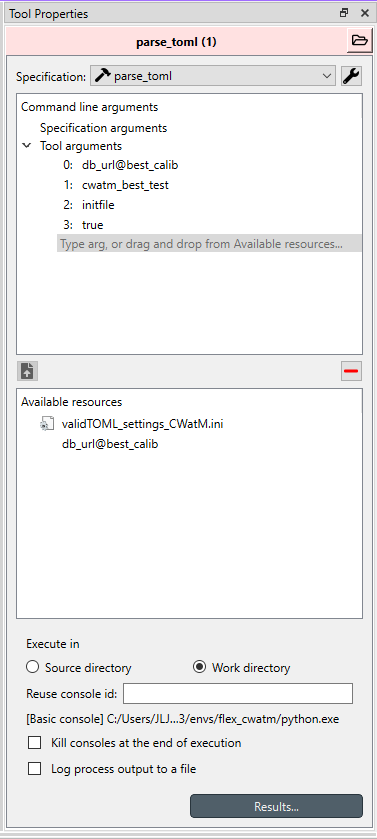
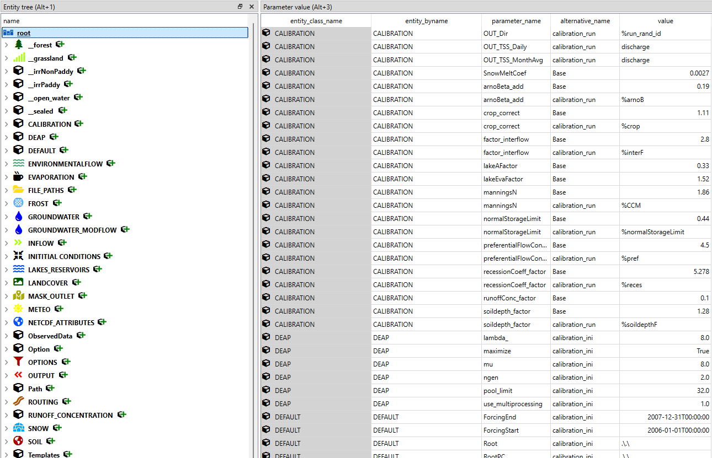

# Navigating the workflow

Points 1 to 3 are optional and are interesting for users that already work with CWatM and would like to continue working on the model development via Toolbox. The workflows from 1-3 are designed to import existing files so users do not have to import them manually from the existing structure. 

When using this workflow from the beginning or setting up a new simulation in CWatM, it is best to go straight to point 4 where a template is made available to populate the database.

## 1. Import of the calibration .ini file into the database

The calibration init file is the typical CWatM ini file that is given in the tutorials. You can re-link the file depending on where you have installed your CWatM copy. The purpose of this process is to populate the ini file entities, parameters, and parameter values into the spine DB interface. All parameters can further be modified once imported into the database. If the calibration init file is modified, a warning -:exclamation:- will be displayed on the first tool meaning that the file needs to be relinked. In this case, just drag and drop the file from the *Available resources* to the *Tool arguments*. The first tool converts the init file into a valid toml file that is standardised and can easily be imported into the *SpineDatabase*.

The parsing of the formatted toml file is then done where some characteristics can be added to the import options.

0: This is the database that is available as resources in the window below (Available Resources)

1: Name of the alternative you would like to import the init file into.

2: This can take 2 type of arguments: "calibration" or "initfile". **a)** If calibration is chosen, then all the parameters in the file will be allocated to the *calibration* alternative. If the calibration alternative already exist in the database, it will allocate it to an automatic numbering e.g. *calibrationxx*. **b)** if the "initfile" argument is filled, it will split the ini cwatm file into 2 separate alternatives; the first alternative with name provided in (1) will contains all the variables except the output. A second alternative called "output_*YOURALTERNATIVE*xx" will contain all the variables for the outputs. The reason being that we can re-use all the variables for the calibration as well without having to create many alternatives but just 1 base-one and then combine the outputs needed.

3: Boolean (***opt***: default=true) set to true or false that defines if the file should be imported in the database or not.  

## 2. Resetting the database

!!! warning

    This second section is to be used cautiously. This resets the database by deleting all its components except the *Base* alternative. The entities inside the *Base* alternative are removed and only the *Base* alternative remains empty. 

By default, the second argument is set to ***false***, which does not reset the Spine Database and just bypasses the whole tool. In case one would like to reset the entire database, set the second argument to ***true*** and the entire Spine Database will be reset.

## 3. Import CWatM .ini files

The third section Imports your working CWatM *ini* file. In essence, you would not need both connectors but for the sake of clarity, two *data connectors* are placed in the workflow. The first *data connector* defines the basic format of CWatM using the *<u>setting_CWatM_template_30min.ini</u>* file distributed by CWatM. The second *data connector* is used to populate any *.ini file that is generated by the user. In both cases, ensure that the paths to the ini files are correct in the *Data Connection Properties* window. 

!!! Attention

    In the first tool, the original *ini* file is being converted into a valid *toml* file. Ensure that the file you want to use is the one you want to import in the Spine Database. 

## 4. The Spine Database

This is the central database, also called the Spine Database, where all the data are stored. *Alternative* and *Scenario* can be created manually and if any data needs to be changed, added, or add new main section in the *.ini* files can be done from the database. However, the preferred way is to import the template from the [CWatM template](../.spinetoolbox/Data/basic_model.json) and change directly after importing the template. When double clicking on database, it will open the Spine Database interface that would look like somewhat similar to what is shown below after completing step 1-3.

The *Entities* are shown on the left-hand side of the table. By selecting the *entity*, only the parameters from the selected entity will be displayed.

If creating it from the template, create a new empty database from the interface (File>New), save it. Then Import the template (File>Import) and select the **[*basic_model.json*](../.spinetoolbox/Data/basic_model.json)**. It contains all the variables, variable definitions and icons.

!!! Tip

    Pay special attention to the *FILE_PATHS* entity as this is the one that will vary between the different alternative e.g. meteo files for the 30-arcmin or 5-arcmin spatial resolution

Basic variables to modify to work with toolbox

| entity name          | Parameter name | Basic value        |
| -------------------- | -------------- | ------------------ |
| OPTIONS              | PathOut        | ./output           |
| INITITIAL CONDITIONS | initLoad       | ./init/FILENAME.nc |
| INITITIAL CONDITIONS | initSave       | ./init/BASINNAME   |

## CWatM template

The template comes with a pre-filled values for all the variables, variable definitions (Parameter definitions), and couple of scenarios.

The pre-filled values integrate the 30 arcmin example from IIASA as definition all stored under the ***Base*** alternative. 

## 5. Run your calibration

Export the database for the calibration and run the calibration. It exports 2 **.ini* files: one for the calibration setup (upper flow) and one for the CWatM model that needs to be calibrated (downward flow). The upstream flow produces a file called *calib_input.ini* and the downstream flow produces a file named *calib_ini.ini*. The arguments from the Tool properties do not need to be updated as they are set for the model. The outputs from the calibration are then exported and setup from the best alternative is imported back into the database under the alternative "best_calib". This section can be run as is. However, by clicking the first arrow, ensure you have created a *calibration* and a *calibration_ini* scenario. The first one includes all the parameters from the *Base* and the *calibration* alternatives to build a readable *ini* file by CWatM and run the calibration. The second one only includes the calibration setup required by the calibration tool. 

!!! Tip

    If you are using the template as mentioned in step 4, the upward arrow should point to the alternative *calibration_ini*, and the downward arrow should point to the scenario *calibration*.

## 6. Run CwatM as a standalone process

Run a regular CWatM flow. This is done from the database and can be run in sequence from the calibration set up. By clicking the yellow arrow before the export tool, one can choose which scenario to run into CWatM.

!!! Tip

    If you are using the template as mentioned in step 4, the scenario *cwatm_template_30arcmin* already include the necessary variables, granted the users have modified the necessary path and have the necessary files (maps, etc...)

## 7. Model coupling CWatM + IRENA FlexTool

With this section, it is possible to run the CWatM model in junction with IRENA FlexTool. The main workflow here is to be able to set a rolling period where the hydrology model is run and then pass the results to IRENA FlexTool. Extra steps to setup the IRENA FlexTool model are required and are explained in the [coupling section](./example_models.md). Note that the coupling could be generalised for sequential coupling with any model.

