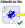
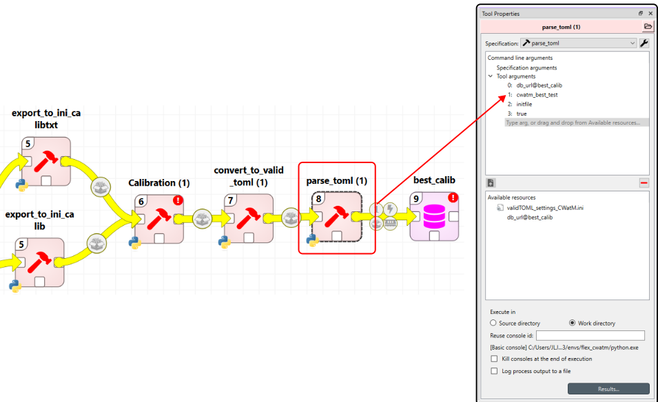

# Setup for calibration

One important part in running hydrology model is the calibration of the model. We have also integrated this feature provided by CWatM for their model. However, this is more tedious setup as the calibration files are not ordered in a way that can be easily be put together. In this page, we will explain how to import calibration file and to which alternative, how to maintain the calibration files and run a calibration example. 


## Importing calibration settings

!!! Tip

    This section refers to the [importing the calibration ini file to Toolbox](navigating.md/#1-import-of-the-calibration-ini-file-into-the-database) part of the workflow

The calibration files coming with CWatM do not match the structure of Toolbox, therefore some changes were made in the init file provided by CWatM. The two important settings are the pathfiles (similar to the the cwatm init file), and in addition, a CALIBRATION section was added to set the variables that needs to be calibrated. CWatM does not perform this step as it assumes users will implement these changes manually in the cwatm init file. However, this step can be automated by selecting the variables that need to be calibrated through the calibration run. 

added section

```ini
[CALIBRATION]
OUT_Dir = %run_rand_id
OUT_TSS_Daily = discharge
OUT_TSS_MonthAvg = discharge
crop_correct =  %crop
soildepth_factor = %soildepthF
preferentialFlowConstant = %pref
arnoBeta_add = %arnoB
factor_interflow = %interF
recessionCoeff_factor = %reces
manningsN = %CCM
normalStorageLimit = %normalStorageLimit
```

One can also skip this step and include the CALIBRATION section manually from the database. However, if this section is added to the original init calibration file, it will be automatically be allocated to a separate alternative called *calibration*

1. select the data connection  and modify the path to the calibration init file. If nothing, there is a separate init file available in this repository under *calibration>settings_calibration_SpineToolBox.txt*
2. ensure that the path to the file is correct in the first tool (convert_to_valid_toml (2))
3. Set the parse_toml tool input arguments and import the file into the database

## Calibration Database

After importing the database, two new alternatives should be added, the first one being the calibration name the users has defined, and the second one is the calibration alternative with the *CALIBRATION* entity class only

In the calibration database, the following entity and parameter_name should be checked to get the correct value

DEFAULT: Root = .\

DEFAULT: RootPC = .\

DEFAULT: Rootbasin = .\

Path: Templates = settings_templates_CWatM

Templates: ModelSettings = calib_cwatm.ini

## Creating a calibration scenario

To run any calibration, one will need 1. a cwatm ini file against which the calibration is made, and a calibration file to know how to calibrate it.

The first step is to recreate a valid CWatM file. If you have not imported any CWatM file into the database as a Base alternative, please go to have a look at the [create a standalone model section](Tutorial.md/#running-standalone-version).

Create a scenario named *calibration* and drag&drop the cwatm base alternative and the *calibration* alternative and you should have this scenario displayed as below


Toolbox will now recreate the CWatM init file taking the base scenario input variables and add/replace the variables with the calibration data.

## Running the calibration

!!! Tip

    This section refers to the [running calibration file in SpineToolbox](navigating.md/#5-run-your-calibration) part of the workflow.

!!! Warning

    Remember to add your measurement files in the calibration tool defined. In the observed data, only those provided by CWatM community for their tutorial is added. Double click the Calibration tool > in the Additional program files section, open the observed_data folder > add your measurements csv (in the correct format as recommended by CWatM) 


To run the calibration, we need to go through two steps. The first steps is to ensure we are creating the correct calibration init file to CWatM and create the correct CWatM init file to run the model in calibration mode

The first step consists in selecting the correct **alternative** from the filter. Filter is displayed while selecting the yellow arrow connecting the database to the export_to_ini_calibtxt tool.


Then in the second flow, we are sending the calibration scenario we created earlier. Ensure you select only the calibration scenario from the link properties of the workflow.


The last task is to ensure what will be the name of the alternative where you want to store the ***best*** results run from the calibration. You can rename the arguments :one: freely.



Select then the workflow and run the selection .

## Results and running best calibration

The calibration run will be committed to the database automatically under the *cwatm_best_test* alternative (or whatever the name of the alternative the use has defined)


 